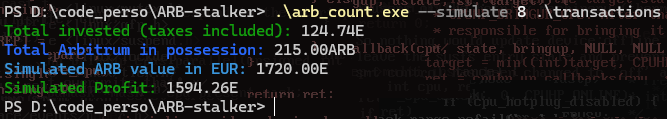

# ARB Stalker 👓

## Introduction 🚀

**ARB Count** is a command-line tool designed to help users manage and evaluate their investments in Arbitrum (ARB) cryptocurrency. The program allows users to track transactions, calculate total investments, and determine potential profits or losses based on the current ARB price. This tool is particularly useful for cryptocurrency enthusiasts and traders who want to keep a close eye on their ARB investments.

## Features 🪶

- **Transaction Tracking**: Add and record transactions including date, amount invested in EUR, and ARB purchased.
- **Investment Overview**: Calculate the total investment amount and ARB holdings from a transaction file.
- **Profit/Loss Calculation**: Determine potential profits or losses by evaluating the current ARB price against the investment amount, considering a 1 EUR cash-out tax.
- **Live Price Fetching**: Fetch the current ARB price in EUR using the CoinGecko API.
- **Simulation Mode**: Simulate potential profit or loss by providing a hypothetical ARB price, allowing you to evaluate different market scenarios.
- **Help Menu**: Provides guidance on how to use the tool via a `-h` flag.

<!-- Container div for centering -->

    <!-- Table for layout -->
    <table>
        <tr>
            <!-- Cell with simulation.png and loss.png side by side -->
            <td>
                
            </td>
            <td>
                
            </td>
        </tr>
        <tr>
            <!-- Cell with count.png below simulation.png -->
            <td colspan="2" align="center">
                
            </td>
        </tr>
    </table>

## Requirements 🖥️

- Windows Operating System
- [Chocolatey](https://chocolatey.org/) package manager
- Node.js
- GCC (GNU Compiler Collection)

## Installation Guide 🧭

[Click here to access the tutorial.](documentation/TUTORIAL.md)
